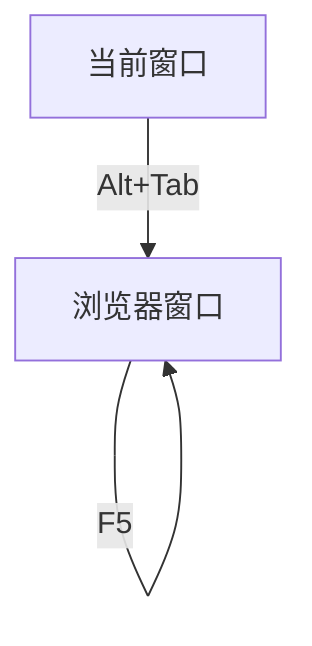

# autopy
## 简介
Autopy是一款运行屏幕自动化脚本的工具。

我们做屏幕自动化任务的时候，通常都会经历这样几个步骤：
1. 检查当前桌面上是否显示了需要的页面（比如查看特定位置的图像，或者比对OCR识别出的文字）
2. 如果确实是，就收集一些文字或图像的信息（这一步未必会有，要看具体任务类型，有些自动化只要把页面流程走通就可以）
3. 查找页面上特定的控件（比如某个按钮），对它进行操作（如点击）
4. 跳转到下一个页面，回到步骤1，反复循环，直到最终页面出现

Autopy把这个过程，抽象为一个状态机模型：每个页面是一个状态（state），通过“action”触发，可以跳转到下一个状态；
在每一个State内部，可以做check（检查是否需要的页面），可以find（查找特定控件，或者收集信息）；
针对find的结果，还可以形成子状态，来实现复杂的操作。

## 示例
Autopy的自动化脚本，由一个yaml配置文件，和子文件夹构成，文件夹中通常存放要查找的图像模板。
一个简单的配置文件示例如下：
```yaml
# 有一个特定的浏览器页面，我们需要定时刷新，以便更新它的状态
name: "浏览器自动刷新"
ver: 0.1
# 默认不会调整屏幕分辨率，所有内容里指定的坐标，都是相对于当前屏幕左上角；
# 但如果这里指定了屏幕宽度或高度，就会在开始运行内容之前，调整分辨率
# screen_width: 3440   
# screen_height: 1440
states:
  - name: "当前窗口"
    # 为了简化，这里假设当前桌面刚刚从浏览器窗口切换到脚本运行窗口，所以一启动就先用alt+tab键切换回去
    id: 1
    transition:
      # 通过点击热键这个action, 迁移到下一个状态
      action: hotkey('alt', 'tab')
      wait: 1
  - name: "浏览器窗口"
    id: 2
    check:
      image:
          snapshot: !rect l:0, r:60, t:113, b:182
          template: auto_test/detect_logo.png
          # debug: True
      fail_action: raise_error('当前页面不是期待的页面')
    transition:
      # 通过点击F5实现浏览器刷新，迁移前先等待60s；
      # 没有其他页面需要显示了，所以还是迁移到当前状态，无限循环
      action: hotkey('f5')
      wait: 60
      to: 2
```
上面这个示例可以用流程图表示如下:


这里states是一个列表，每个列表项是一个状态，每个状态有一个id属性作为唯一标识。状态之间的迁移，通过transition属性的to来指定。
to指定的内容可以是某一个state的id，也可以是next（缺省值），next意味着迁移到下一个状态（按列表定义顺序，而不是id编号顺序）。

transition的action是表示触发迁移的动作，支持键盘鼠标、屏幕、剪贴板、窗口引用（目前只支持windows）等一系列操作。
transition的wait表示动作执行以后，等待的时间。

这里的check属性里面定义了image，用来检测屏幕上特定区域是否显示了指定的图案，如果图案存在，说明正确进入了当前状态；
如果不存在，会触发fail_action的执行。

## 配置类
实际上，每个配置项，都有对应的数据类型定义，autopy读取配置文件的时候，会通过objtyping把yaml数据转换为对应的类实例。

数据类型定义，请参照 [autopy 类图](docs/autopy_class_diagram.md)

本文档开头实例中的配置文件，转换之后的实例关系图如下：[autopy 示例对象图](docs/autopy_sample_object_diagram.md)


## 配置项参考
详见 [autopy 参考文档](docs/autopy_reference.md)

